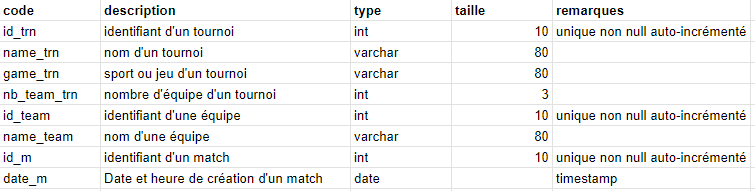
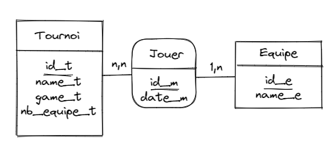
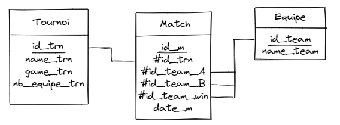

# Configuration

Ouvrir un terminal dans le dossier et exécuter `composer install`

Créer un fichier .env.local dans /config, et personnaliser les infos contenues dans le fichier .env

# Idée du projet

L'idée était de partir sur une appli de création de tournoi. En renseignant le nom du tournoi, le jeu/sport, les équipes, l'application nous renverrait un tableau des matchs. Ensuite on pourrait suivre ce tournoi en renseignant les vainqueurs des matchs, et l'application nous sortirait les matchs suivants, jusqu'à obtenir un vainqueur.

Spoil : je n'ai pas fini !

Je me suis rapidement heurté à pas mal de limites sur ce projet, et j'ai du amoindrir mes envies. D'abord, pour ne pas avoir de comportement trop complexe à gérer, il a fallu choisir de faire uniquement des arbres de phases finales, pas de phases de poules. Ensuite, il faut limiter le nombre d'équipes dans le tournoi à une puissance de 2 *(4, 8, 16, 32, 64...)*, afin d'avoir un arbre propre et équilibré jusqu'à la finale.

# 1è étape : la BDD

## Conceptualisation

### Règles de gestion
- Un tournoi possède un id, un nom, un sport/jeu, un nombre d'équipes
- Une équipe possède un id, un nom
- Un match possède un id, un tournoi, une équipe A, une équipe B, une équipe vainqueure
  
    Plus tard avec toi, on a décidé d'ajouter un TIMESTAMP à la création d'un match pour pouvoir les classer dans l'ordre de leur création
### Dictionnaire de données

### Dépendances fonctionnelles
- **__id_trn__** ? name_trn, game_trn, nb_team_trn
- **__id_team__** ? name_team
- **__id_m__** ? date_m
### Schéma MCD

### MLD
- **Tournoi** (__id_trn__, name_trn, nb_team_trn)
- **Match** (__id_m__, #id_trn, #id_team_A, #id_team_B, #id_team_win, date_m)
- **Equipe** (__id_team__, name_team)
### MPD (simplifié)

# Début du code
## Structure
En premier, j'ai commencé par structurer au mieux mon code : dossier config, dossier layout avec header et footer qu'on require_once... J'ai très vite commencé à créer des classes, dans un dossier classes, que j'ai renommé src en implémentant l'autoload de composer.
## Les classes
Tout au long de mon projet, j'ai travaillé un maximum autour des classes, en commençant dès le début en créant les classes Tournament, Game et Team. Au début, j'ai mis en place des méthodes dans la classe Tournament pour travailler avec la base de données. 

Au moment de la mise en place de l'autoloader, j'ai commencé à créer TournamentCrud, une nouvelle classe, afin d'accéder au Crud des tournois de manière claire. Puis j'ai mis en place également GameCrud ainsi que TeamCrud, avec les méthodes de base du CRUD : *list*, *get*, *create*, *update* et *delete*. J'avais d'abord supprimé les classes Team et Game, avant de les remettre afin de clarifier le code et mieux communiquer entre les pages et les classes de CRUD.

Petit à petit, j'ai ajouté aux classes de CRUD des méthodes qui allaient me servir pour mon projet. Telles que *lastCreatedId*, qui retournent l'id du dernier tournoi ou de la dernière équipe créée, qui me permettent de récupérer cet ID et m'en servir pour la création des matchs. Ou encore *createFirstRound* dans GameCrud, qui créé dans la base de données la 1ère ronde d'un tournoi : elle utilise différentes fonctions que j'ai du créer toujours dans cette volonté de clarifier au maximum le code.

A la fin, j'ai encore différentes modifications à effectuer : mieux utiliser les relations entre classes. Certaines fois mon Crud me retourne un tableau associatif, je pense qu'il pourrait me retourner une classe Entity. Ou à l'inverse, certaines fois j'entre en paramètre de méthode un ID, je devrais peut être entrer l'instanciation d'une classe Entity.

Un point que je n'ai pas du tout eu le temps de développer également : l'héritage. Je pense qu'une classe "Crud" et une autre "Entity", parentes de celles que j'ai déjà, peuvent être intéressante pour factoriser le code de mes classes.
## Les fonctions
J'ai du créer des fonctions, d'abord dans un fichier *functions.php*, puis dans une classe *Utils*. 

- Une fonction qui teste si un nombre est une puissance de 2, afin de vérifier si le client rentre une valeur acceptée dans le formulaire de création de tournoi.
- Dans mon formulaire, qui garde certaines infos si on change de page, j'ai voulu afficher le nombre de team enregistré dans le SELECT. J'ai fait une fonction pour tester quelle option doit avoir *selected*
- Pour ma création de premier tour de tournoi, j'ai fait une fonction qui renvoie une clé aléatoire d'un tableau. Puis une autre qui supprime des valeurs du tableau.
- Et puis une fonction *redirect*, pour plus de clarté lorsqu'on redirige vers une autre page

## L'affichage des tournois créés
La première fonctionnalité sur laquelle j'ai travaillé, afficher la liste des tournois sur `index.php`. Puis en cliquant sur l'un d'eux, par méthode GET grâce à l'ID du tournoi, on nous envoie sur `tournament.php?id=*idTourn*`.
Là, on affiche le nom du tournoi, le jeu/sport, et la liste des matchs. J'ai longtemps eu un var_dump pour vérifier que ça marchait, sans me pencher sur le côté affichage. Puis j'ai décidé de mettre un minimum en page chaque match, et de gérer si on connaissait le vainqueur ou non. Si on ne le connait pas, le match s'affiche avec les 2 noms d'équipes, sans fond. S'il y a un vainqueur, son nom s'affiche sur fond vert, et le nom du perdant sur fond rouge.

## Création de tournoi
Une étape plutôt longue sur laquelle j'ai voulu bien tout comprendre et tout faire petit à petit. J'ai du créer un formulaire en plusieurs étapes. 

D'abord, l'étape de création du tournoi : on demande le nom, le jeu/sport, et le nombre d'équipes. La validation de cette partie nous envoie sur la 2ème partie en méthode POST : la création des équipes. 

En testant comment fonctionnait les informations contenues dans `$_POST` sur un formulaire en plusieurs étapes, j'ai décidé de mettre les valeurs récupérées de la première étapes dans `$_SESSION`, et de récupérer les informations de la 2è étape par méthode POST. La validation de la 2è étape nous emmène donc vers `formsent.php` où on teste qu'on a bien gardé les informations de la première, dans `$_SESSION`. 

On utilise tout ça pour créer un tournoi dans la base de données, puis on récupère tous les noms d'équipes, récupérées dans `$_POST`, pour les créer dans la base de données.

Puis on créé les matchs de la 1ère ronde, grâce à la méthode *createFirstRound* que j'ai expliqué plus haut. Et enfin, on redirige vers l'index.

## Errors et Success
La gestion d'erreur n'est clairement pas optimisée, je n'ai pas pris le temps de créer mes propres Exceptions pour clarifier les erreurs, surtout côté serveur
Cependant, sur les quelques erreurs côté client que j'ai géré, j'ai choisi d'utiliser des messages "flash" comme on avait vu avec toi, véhiculés par `$_SESSION`